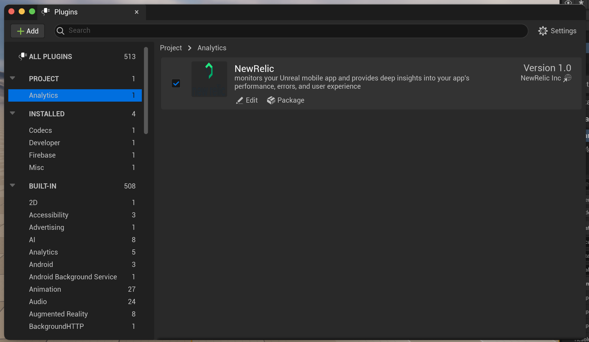
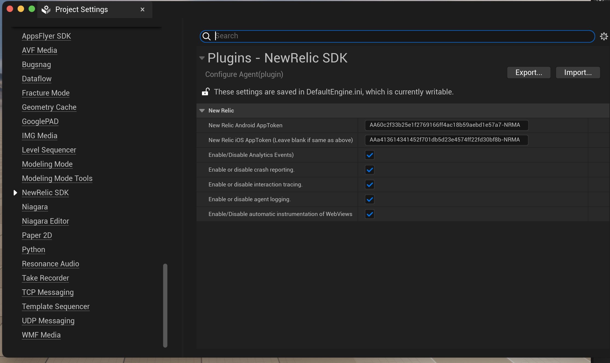
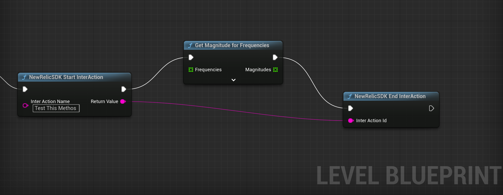
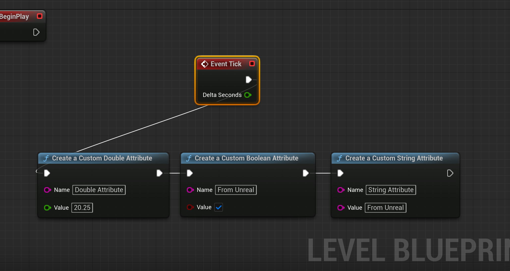
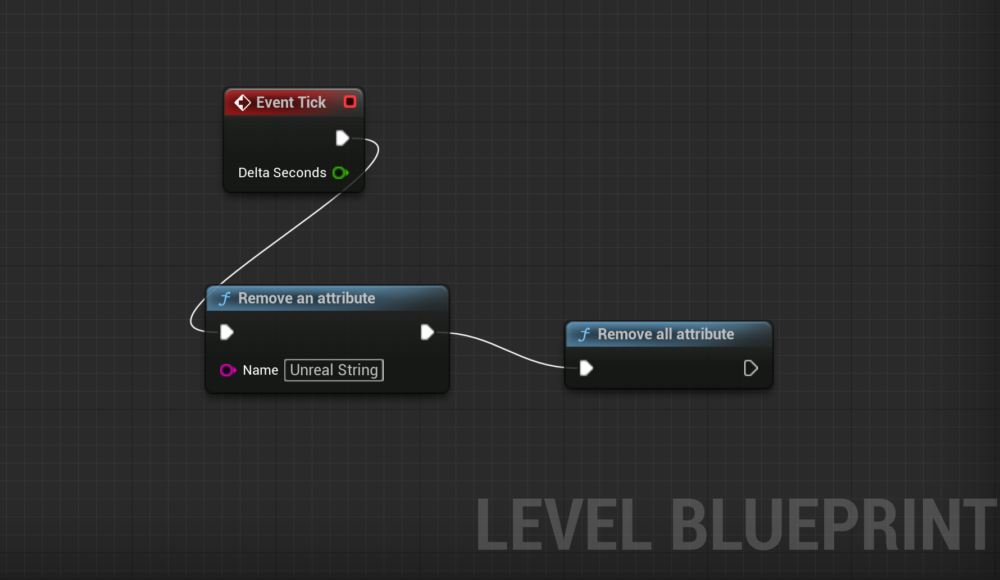
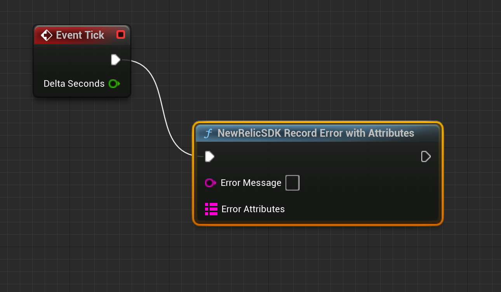
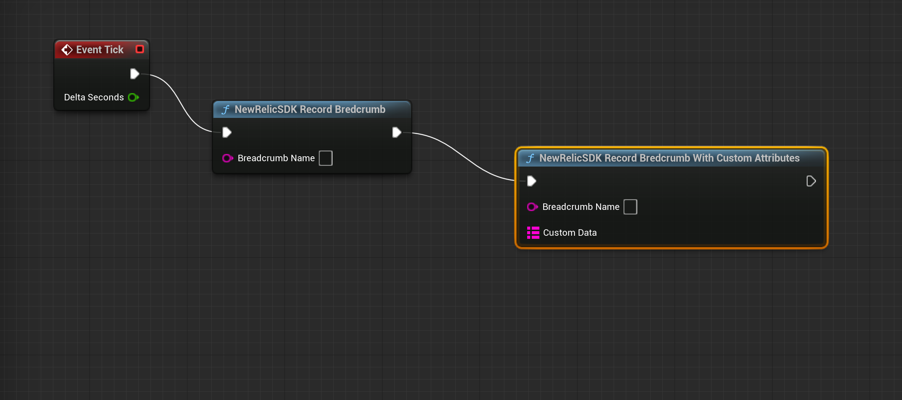
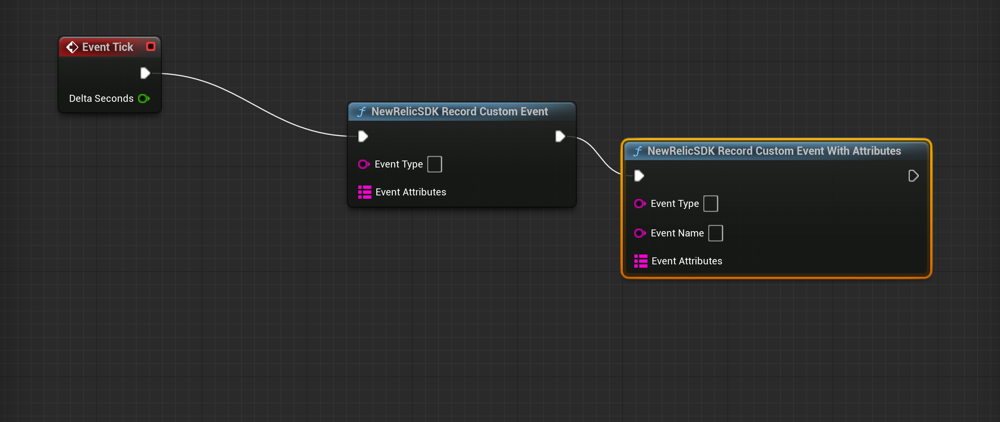

[](https://opensource.newrelic.com/oss-category/#community-plus)


# New Relic Unreal Engine Agent

This agent utilizes the native New Relic Android and iOS agents to instrument Unreal Engine Mobile apps. The New Relic SDKs gather data such as crashes and other relevant information to help monitor and assess the performance of Unreal Engine Mobile apps.

## Features
* Record and Capture errors
* Handled Exception
* Capture interactions and the sequence in which they were created
* Pass user information to New Relic to track user sessions
* offline monitoring of events and exceptions
* C++ Crashes (iOS Only)

## Current Support:
- Android API 24+ (AGP 7 and Higher)
- iOS 10
- Depends on New Relic iOS/XCFramework and Android agents

## Installation
**From the Unreal Engine Marketplace**
1. Install the NewRelic plugin from the Unreal Engine Marketplace.
2. Enable the plugin from the Plugins window in Unreal Editor, available in the main menu under Edit → Plugins.
3. Select NewRelic under “Installed” plugins, and check the “Enabled” checkbox.
)
4. Click “Restart Now” to continue configuration.

5. Add NewRelic to the list of dependencies in your game module’s .Build.cs file in order to allow interfacing with NewRelic from C++ code:

PrivateDependencyModuleNames.Add("NewRelic");

## Basic configuration#
Configure your API key through Unreal Editor’s Project Settings window, under Plugins → NewRelic.



Or in Config/DefaultEngine.ini:
[/Script/NewRelic.NewRelicSDKSettings]
newrelicAppToken=application-token
newrelicAppTokenIOS=ios-application-token

## Usage

See the examples below, and for more detail, see [New Relic IOS SDK doc](https://docs.newrelic.com/docs/mobile-monitoring/new-relic-mobile-ios/ios-sdk-api) or [Android SDK](https://docs.newrelic.com/docs/mobile-monitoring/new-relic-mobile-android/android-sdk-api).

### [startInterAction](https://docs.newrelic.com/docs/mobile-monitoring/new-relic-mobile-android/android-sdk-api/start-interaction)(FString name): &lt;InteractionId&gt;;
> Track a method as an interaction.

`InteractionId` is string.


### [endInterAction](https://docs.newrelic.com/docs/mobile-monitoring/new-relic-mobile-android/android-sdk-api/end-interaction)(FString interactionIdentifier): void;
> End an interaction
> (Required). This uses the string ID for the interaction you want to end.
> This string is returned when you use startInteraction().

  ```C++

     #include "NewRelicBPLibrary.h"

  
    FString id =  UNewRelicBPLibrary::startInterAction("test Unreal InterAction");

    FPlatformProcess::Sleep(6.0);   

    UNewRelicBPLibrary::endInterAction(id);
  ```

Using Blueprint :



### [setBooleanAttribute](https://docs.newrelic.com/docs/mobile-monitoring/new-relic-mobile-android/android-sdk-api/set-attribute)(Boolean value): void;

> Creates a session-level boolean attribute shared by multiple mobile event types. Overwrites its previous value and type each time it is called.
  ```C++

     #include "NewRelicBPLibrary.h"

     UNewRelicBPLibrary::setBooleanAttribute("From Unreal",true);
  ```

### [setDoubleAttribute](https://docs.newrelic.com/docs/mobile-monitoring/new-relic-mobile-android/android-sdk-api/set-attribute)(double value): void;

> Creates a session-level double attribute shared by multiple mobile event types. Overwrites its previous value and type each time it is called.
  ```C++

     #include "NewRelicBPLibrary.h"

     UNewRelicBPLibrary::setDoubleAttribute("Unreal Double", 15.0);;
  ```

  ### [setStringAttribute](https://docs.newrelic.com/docs/mobile-monitoring/new-relic-mobile-android/android-sdk-api/set-attribute)(FString value): void;

> Creates a session-level double attribute shared by multiple mobile event types. Overwrites its previous value and type each time it is called.
  ```C++

     #include "NewRelicBPLibrary.h"

     UNewRelicBPLibrary::setStringAttribute("Unreal String","From UnReal");

  ```
  
  Using BluePrint:
  
  

### [removeAttribute](https://docs.newrelic.com/docs/mobile-monitoring/new-relic-mobile-android/android-sdk-api/remove-attribute)(FString name): void;
> This method removes the attribute specified by the name string..
  ```C++
       #include "NewRelicBPLibrary.h"

     UNewRelicBPLibrary::removeAttribute("Unreal String");
  ```

### [removeAllAttributes](https://docs.newrelic.com/docs/mobile-monitoring/new-relic-mobile-android/android-sdk-api/remove-all-attributes)(): void;
> Removes all attributes from the session
```C#
    #include "NewRelicBPLibrary.h"
  
    UNewRelicBPLibrary::removeAllAttributes();
```
Using Blueprint:




### recordError(FString error,TMap <FString, FString> errorAttributes ): void;
> Records errors for Unreal with Map Parameters .
```C++
      #include "NewRelicBPLibrary.h"

      TMap<FString, FString> errorsMap;
      errorsMap.Add("place", TEXT("Robots"));
      errorsMap.Add("user", TEXT("Nisarg"));
       UNewRelicBPLibrary::recordError(TEXT("Error Message"), errorsMap);
```
Using Blueprint:


### [setMaxEventBufferTime](https://docs.newrelic.com/docs/mobile-monitoring/new-relic-mobile-android/android-sdk-api/set-max-event-buffer-time)(int64 seconds): void;
> Sets the event harvest cycle length. Default is 600 seconds (10 minutes). Minimum value can not be less than 60 seconds. Maximum value should not be greater than 600 seconds.
```C++
     #include "NewRelicBPLibrary.h"

     UNewRelicBPLibrary::setMaxEventBufferTime(60);
```

### [setMaxEventPoolSize](https://docs.newrelic.com/docs/mobile-monitoring/new-relic-mobile-android/android-sdk-api/set-max-event-pool-size)(int64 size): void;
> Sets the maximum size of the event pool stored in memory until the next harvest cycle. Default is a maximum of 1000 events per event harvest cycle. When the pool size limit is reached, the agent will start sampling events, discarding some new and old, until the pool of events is sent in the next harvest cycle.
```C++
     #include "NewRelicBPLibrary.h"

     UNewRelicBPLibrary::setMaxEventPoolSize(2000);
```

### [incrementAttribute](https://docs.newrelic.com/docs/mobile-monitoring/new-relic-mobile-android/android-sdk-api/increment-attribute)(FString name, double amount): void;
> Increments the count of an attribute with a specified name. Overwrites its previous value and type each time it is called. If the attribute does not exists, it creates a new attribute. If no value is given, it increments the value by 1.
```C++
    #include "NewRelicBPLibrary.h"

    UNewRelicBPLibrary::incrementAttribute("Unreal Double",5.0)
```
### [setUserId](https://docs.newrelic.com/docs/mobile-monitoring/new-relic-mobile-android/android-sdk-api/set-user-id)(FString userId): void;
> Set a custom user identifier value to associate user sessions with analytics events and attributes.
  ```C++
      #include "NewRelicBPLibrary.h"

      UNewRelicBPLibrary::setUserId("Unreal12934");
  ```

 ### [recordBreadcrumb](https://docs.newrelic.com/docs/mobile-monitoring/new-relic-mobile-android/android-sdk-api/recordbreadcrumb)(FString breadcrumbName): void;
> Track app activity/screen that may be helpful for troubleshooting crashes.

  ```C++
      #include "NewRelicBPLibrary.h"

      UNewRelicBPLibrary::.recordBreadCrumb("Unreal Breadcrumb Without Attribute");
  ```

   ### [recordBreadCrumbWithAttributes](https://docs.newrelic.com/docs/mobile-monitoring/new-relic-mobile-android/android-sdk-api/recordbreadcrumb)(FString breadcrumbName,TMap <FString, FString> customData): void;
> Track app activity/screen that may be helpful for troubleshooting crashes with Custom Attributes.

  ```C++
      #include "NewRelicBPLibrary.h"

      TMap<FString, FString> breadCrumbMap;
      breadCrumbMap.Add("place", TEXT("Robots"));
      breadCrumbMap.Add("user", TEXT("Nisarg"));

      UNewRelicBPLibrary::recordBreadCrumbWithAttributes("Unreal Breadcrumb",breadCrumbMap);
  ```

  Using BluePrint:
  


### [recordCustomEvent](https://docs.newrelic.com/docs/mobile-monitoring/new-relic-mobile-android/android-sdk-api/recordcustomevent-android-sdk-api)(FString eventType, TMap <FString, FString> eventAttributes): void;
> Creates and records a custom event for use in New Relic Insights.

  ```C++
        #include "NewRelicBPLibrary.h"

         TMap<FString, FString> customEventMap;
         customEventMap.Add("place", TEXT("Robots"));
         customEventMap.Add("user", TEXT("user1"));

        UNewRelicBPLibrary::recordCustomEvent("Unreal Custom Event Example", customEventMap);
  ```

  ### [recordCustomEventWithEventType](https://docs.newrelic.com/docs/mobile-monitoring/new-relic-mobile-android/android-sdk-api/recordcustomevent-android-sdk-api)(FString eventType,FString eventName, TMap <FString, FString> eventAttributes): void;
> Creates and records a custom event for use in New Relic Insights.

  ```C++
        #include "NewRelicBPLibrary.h"
        
         TMap<FString, FString> customEventMap;
         customEventMap.Add("place", TEXT("Robots"));
         customEventMap.Add("user", TEXT("user1"));

        UNewRelicBPLibrary::recordCustomEvent("Unreal Custom Event Type","Unreal Custom Event Example", customEventMap);
  ```

  Using BluePrint:
  

### [currentSessionId](https://docs.newrelic.com/docs/mobile-monitoring/new-relic-mobile-android/android-sdk-api/currentsessionid-android-sdk-api)(): FString;
> Returns the current session ID. This method is useful for consolidating monitoring of app data (not just New Relic data) based on a single session definition and identifier.
```C++
    #include "NewRelicBPLibrary.h"
   
    FString id =  UNewRelicBPLibrary::currentSessionId();

```
### [shutdown](https://docs.newrelic.com/docs/mobile-monitoring/new-relic-mobile-android/android-sdk-api/shut-down/)() : void;
> Shut down the agent within the current application lifecycle during runtime.
```C++
    #include "NewRelicBPLibrary.h"      

    UNewRelicBPLibrary::shutdown();
```

### [crashNow](https://docs.newrelic.com/docs/mobile-monitoring/new-relic-mobile-android/android-sdk-api/crashnow-android-sdk-api)(FString message): void;
> Throws a demo run-time exception to test New Relic crash reporting.

```C++
     #include "NewRelicBPLibrary.h"      

    UNewRelicBPLibrary::crashNow();
```


